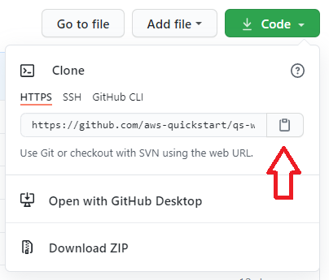

A _clone_ is a copy of the GitHub repository downloaded locally to your IDE. You can clone your forked repository using the *_git clone_* command.

1. From your forked GitHub repository, obtain the URL to use for cloning by clicking the *code* button and then clicking the button to copy the URL. _Make sure you have selected "HTTPS" and not "SSH".

[#clone1]
.Obtaining the clone URL

[start=2]
2. Open your Cloud9 IDE created earlier
3. Close out the Welcome tab

[#clone2]
.The Cloud9 Welcome tab
image::../images/image3.png[Clone,width=75%,height=75%]

[start=4]
4. In the terminal at the bottom of the screen, type *_git clone <the URL you copied previously>_*

[#clone3]
.The Cloud9 Welcome tab
image::../images/image5.png[Clone,width=50%,height=50%]

You should see the following output:

[Output]
----
Cloning into 'qs-workshop-2021'...
remote: Enumerating objects: 17, done.
remote: Counting objects: 100% (17/17), done.
remote: Compressing objects: 100% (15/15), done.
remote: Total 17 (delta 0), reused 13 (delta 0), pack-reused 0
Unpacking objects: 100% (17/17), done.
----
