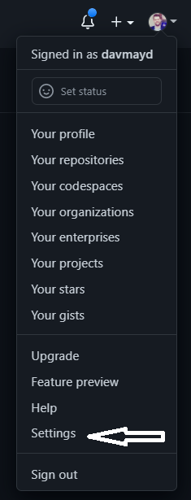
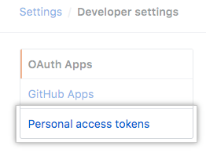
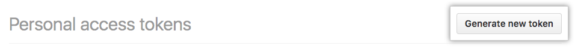

The first step in modifying a Quick Start is to ensure you have an IDE available for working on the Quick Start components. AWS Cloud9 is a cloud-based IDE that lets you write, run, and debug your code with just a browser. It includes a code editor, debugger, and terminal.

1. Open the https://console.aws.amazon.com/cloud9/home?region=us-east-1#[AWS Cloud9 console].
2. From the Region selection list in the top-right corner, make sure you are in the us-east-1 (N. Virginia) Region.
3. Click *Create environment*
4. Enter a name for your environment and click *Next step*

[#cloud9_1]
.Creating a Cloud9 IDE
image::../images/image1.png[cloud9,width=75%,height=75%]

[start=5]
5. Select an instance type. _If you are using your own account and want to avoid incurring any charges, keep the default instance type, which is https://aws.amazon.com/free/[AWS Free Tier] eligible_
6. Change the cost-saving setting to *After four hours* to ensure your IDE isn't shut down due to inactivity
7. Leave all other fields at their default values and click *Next step*
8. Click *Create environment*

The Cloud9 IDE will be created after a few minutes.

=== Create GitHub personal access token

You will need to create a GitHub personal access token and add it to Cloud9.

1. From GitHub, click *Settings*

[#token1]
.GitHub settings

[start=2]

2. Select *Developer settings*, then *Personal access tokens*

[#token2]
.Developer settings
image::../images/token2.png[token,width=25%,height=25%]

[#token3]
.Personal access tokens

[start=3]

3. Click *Generate new token*, give the token a name, and select *repo* for permissions

[#token4]
.Generate new token

[#token5]
.Token permissions
image::../images/token5.gif[token,width=100%,height=100%]

[start=4]

4. Copy the token and save it in a text editor. This will be used when cloning a repository later in this workshop.

[#token6]
.Copy token
image::../images/token6.png[token,width=100%,height=100%]
