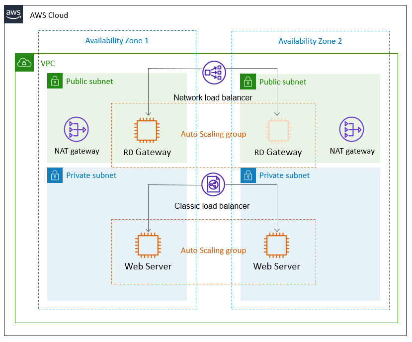

=== Our Goal

In this workshop, you will:

* Create a Cloud9 Integrated Development Environment (IDE) for working on a Quick Start
* Fork a sample Quick Start into your own GitHub account
* Clone the Quick Start to your IDE
* Learn the components that make up the Quick Start
* Make any modifications you would like to the Quick Start
* Test the modified Quick Start to ensure it deploys successfully
* Push your changes to your forked repository
* Upload your customized Quick Start to an S3 bucket
* Deploy the Quick Start in your account

=== Architecture

The Quick Start that is being forked and modified uses the following architecture:

:xrefstyle: short
[#architecture1]
.Quick Start architecture

The architecture contains the following components:

* A virtual private cloud (VPC) that spans two Availability Zones, configured with two public and two private subnets.
* AWS-managed network address translation (NAT) gateways deployed into the public subnets and configured with an Elastic IP address for outbound internet connectivity. The NAT gateways are used for internet access for all EC2 instances launched within the private network.
* Amazon EC2 web server instances launched in the private subnets, with auto-scaling group enabled to automatically increase capacity if there is a demand spike, and to reduce capacity during low traffic times.
* Either Remote Desktop Gateway or Linux Bastion EC2 instances launched in the public subnets, with auto-scaling group enabled to automatically deploy a new instance if the running instance fails.
* Elastic Load Balancing deployed to automatically distribute traffic across the multiple web server instances.
* Elastic Load Balancing deployed to enable access to the Remote Desktop Gateway instance.
* An AWS Identity and Access Management (IAM) instance role with fine-grained permissions for accessing AWS services necessary for the deployment process.
* Appropriate security groups for each instance to restrict access to only necessary protocols and ports. For example, access to HTTP server ports on Amazon EC2 web servers is limited to Elastic Load Balancing.
