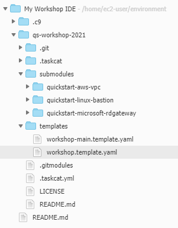

=== Viewing the CloudFormation sections

Now that you've verified that your forked code works as intended, you can modify the code to fit your use case. The Quick Start contains two templates: a _main_ template and a _workload_ template. The _main_ template is a parent template, it deploys other templates in sequence: VPC, workload, and Remote Desktop Gateway or Linux Bastion. The _workload_ template deploys the actual Quick Start workload: the auto-scaling web server group and the load balancer. AWS customers and Partners can make whatever changes they want to either of these templates to suit their own use cases.

1. From the folder view, double-click on the file *templates/workshop.template.yaml*

[#modification1]
.Expanded folder view

[start=2]
2. You should now be able to view and modify the template. Here we'll go over the different template sections.

* The first line is *AWSTemplateFormatVersion*. As of right now all CloudFormation templates have the value '2010-09-09'.
* The second section is the description, which is simply a textual description of what the template does.
* Next we have the template *Metadata*.
** The first bit of metadata is the CloudFormation interface. This describes how the CloudForamtion console will look to the end customer when the template is launched.
*** *ParameterGroups* describe how the parameters should be grouped in the CloudFormation console.
*** *ParameterLabels* apply descriptive labels to the parameters in the CloudFormation console.
* Next is the *Parameters* section. All of the parameters used to launch the template are here, along with parameter descriptions, restrictions, types, and default values where applicable.
* *Rules* ensure the template has parameter values that won't cause it to fail.
* *Mappings* ensure Region-specific Amazon Machine Images (AMIs) are used for the EC2 instances.
* *Conditions* are statements that are true if they meet certain conditions. In this case, the condition _UsingDefaultBucket_ is true if the _QSS3BucketName_ parameter value is "aws-quickstart".
* *Resources* are the actual assets deployed to a customer account. Resources deployed by this tempalte include a Simple Notification Service (SNS) topic, EC2 security groups, an elastic load balancer, IAM roles, an auto-scaling group launch configuration, an auto-scaling group, CloudWatch alarms, and an S3 bucket.
* *Outputs* are presented to the customer after the template has completed deploying, such as the fully-qualified domain name used to access a web application.

[start=3]
3. We will now make some very basic modifications to the template: we will update the EC2 image ID to use Amazon Linux 2 (as opposed to Amazon Linux), and we will update the EC2 instance userdata to deploy a basic website.

=== Updating the AMI Region map and EC2 image ID

The AMI Region map can be found in *templates/workshop.template.yaml* at lines 187-217. This is the area of the template used to ensure the workload instances are use the correct AMI ID for the Region into which the template is being deployed. As you can see, this template supports only Amazon Linux (not Amazon Linux 2, or Ubunto, or CentOS, etc.). By replacing the Region mappings with additional mappings for additional flavors of Linux, and by adding support for additional Regions, we can add flexibility to the Quick Start. Replace the mappings with the following:

----
  AWSAMIRegionMap:
    af-south-1:
      AMZNLINUX2: ami-0936d2754993c364e
      AMZNLINUX2ARM: ami-01d326fa7db123542
      US2004HVM: ami-022666956ad401a16
      CENTOS7HVM: ami-0a2be7731769e6cc1
#      SLES15HVM: ami-EXAMPLE
    ap-northeast-1:
      AMZNLINUX2: ami-0ca38c7440de1749a
      AMZNLINUX2ARM: ami-005322a6d5cecfe58
      US2004HVM: ami-015f1a68ce825a8d2
      CENTOS7HVM: ami-06a46da680048c8ae
      SLES15HVM: ami-056ac8ad44e6a7e1f
    ap-northeast-2:
      AMZNLINUX2: ami-0f2c95e9fe3f8f80e
      AMZNLINUX2ARM: ami-01b0796a552129792
      US2004HVM: ami-0be9734c9e68b99f4
      CENTOS7HVM: ami-06e83aceba2cb0907
      SLES15HVM: ami-0f81fff879bafe6b8
    ap-northeast-3:
      AMZNLINUX2: ami-06e9ad0943b200859
      AMZNLINUX2ARM: ami-02415340f44a47b93
      US2004HVM: ami-01cb3e73f8ef13fdc
      CENTOS7HVM: ami-02d6b455335e3af14
      SLES15HVM: ami-0d8518dd12d11dfc2
    ap-south-1:
      AMZNLINUX2: ami-010aff33ed5991201
      AMZNLINUX2ARM: ami-01ad94fdf8150776c
      US2004HVM: ami-00aaac1f2ef4ce965
      CENTOS7HVM: ami-026f33d38b6410e30
      SLES15HVM: ami-01be89269d32f2a16
    ap-southeast-1:
      AMZNLINUX2: ami-02f26adf094f51167
      AMZNLINUX2ARM: ami-006eccfc9e6f597af
      US2004HVM: ami-0012ffabeb7413479
      CENTOS7HVM: ami-07f65177cb990d65b
      SLES15HVM: ami-070356c21596ddc67
    ap-southeast-2:
      AMZNLINUX2: ami-0186908e2fdeea8f3
      AMZNLINUX2ARM: ami-00719b70b31680d14
      US2004HVM: ami-03ec1fe05b3849c74
      CENTOS7HVM: ami-0b2045146eb00b617
      SLES15HVM: ami-0c4245381c67efb39
    ca-central-1:
      AMZNLINUX2: ami-0101734ab73bd9e15
      AMZNLINUX2ARM: ami-039750f0a88733fff
      US2004HVM: ami-04c56d394d31cdeac
      CENTOS7HVM: ami-04a25c39dc7a8aebb
      SLES15HVM: ami-0c97d9b588207dad6
    eu-central-1:
      AMZNLINUX2: ami-043097594a7df80ec
      AMZNLINUX2ARM: ami-000cbb96a79217336
      US2004HVM: ami-0980c5102b5ef10cc
      CENTOS7HVM: ami-0e8286b71b81c3cc1
      SLES15HVM: ami-05dfd265ea534a3e9
    me-south-1:
      AMZNLINUX2: ami-0880769bc15eeec4f
      AMZNLINUX2ARM: ami-001dc219c441b922d
      US2004HVM: ami-03cc0b5db8321f2e5
      CENTOS7HVM: ami-011c71a894b10f35b
      SLES15HVM: ami-0252c6d3a59c7473b
    ap-east-1:
      AMZNLINUX2: ami-0aca22cb23f122f27
      AMZNLINUX2ARM: ami-01f5cec80321bd86e
      US2004HVM: ami-0c7e5903bee96ef81
      CENTOS7HVM: ami-0e5c29e6c87a9644f
      SLES15HVM: ami-0ad6e15bcbb2dbe38
    eu-north-1:
      AMZNLINUX2: ami-050fdc53cf6ba8f7f
      AMZNLINUX2ARM: ami-00a8ac2b5311cd613
      US2004HVM: ami-0663a4867a210287a
      CENTOS7HVM: ami-05788af9005ef9a93
      SLES15HVM: ami-0741fa1a008af40ad
    eu-south-1:
      AMZNLINUX2: ami-0f447354763f0eaac
      AMZNLINUX2ARM: ami-011d4067dedd119f5
      US2004HVM: ami-035e213233577516f
      CENTOS7HVM: ami-03014b98e9665115a
      SLES15HVM: ami-051cbea0e7660063d
    eu-west-1:
      AMZNLINUX2: ami-063d4ab14480ac177
      AMZNLINUX2ARM: ami-00552336fb4b81164
      US2004HVM: ami-0213344887e47003a
      CENTOS7HVM: ami-0b850cf02cc00fdc8
      SLES15HVM: ami-0a58a1b152ba55f1d
    eu-west-2:
      AMZNLINUX2: ami-06dc09bb8854cbde3
      AMZNLINUX2ARM: ami-03144ab666315a8a3
      US2004HVM: ami-0add0a5a0cf9afc6c
      CENTOS7HVM: ami-09e5afc68eed60ef4
      SLES15HVM: ami-01497522185aaa4ee
    eu-west-3:
      AMZNLINUX2: ami-0b3e57ee3b63dd76b
      AMZNLINUX2ARM: ami-009b1ed4d1f59029a
      US2004HVM: ami-01019e7343a5f361d
      CENTOS7HVM: ami-0cb72d2e599cffbf9
      SLES15HVM: ami-0f238bd4c6fdbefb0
    sa-east-1:
      AMZNLINUX2: ami-05373777d08895384
      AMZNLINUX2ARM: ami-0092271c8131fcde7
      US2004HVM: ami-0312c74c38dc7bae6
      CENTOS7HVM: ami-0b30f38d939dd4b54
      SLES15HVM: ami-0772af912976aa692
    us-east-1:
      AMZNLINUX2: ami-0d5eff06f840b45e9
      AMZNLINUX2ARM: ami-002cc39e7bf021a77
      US2004HVM: ami-0db6c6238a40c0681
      CENTOS7HVM: ami-0affd4508a5d2481b
      SLES15HVM: ami-0b1764f3d7d2e2316
    us-gov-west-1:
      AMZNLINUX2: ami-0bbf3595bb2fb39ec
      AMZNLINUX2ARM: ami-6bd0e80a
      SLES15HVM: ami-57c0ba36
    us-gov-east-1:
      AMZNLINUX2: ami-0cc17d57bec8c6017
      AMZNLINUX2ARM: ami-4a31d93b
      SLES15HVM: ami-05e4bedfad53425e9
    us-east-2:
      AMZNLINUX2: ami-077e31c4939f6a2f3
      AMZNLINUX2ARM: ami-0029d4ab5707ce922
      US2004HVM: ami-03b6c8bd55e00d5ed
      CENTOS7HVM: ami-01e36b7901e884a10
      SLES15HVM: ami-05ea824317ffc0c20
    us-west-1:
      AMZNLINUX2: ami-04468e03c37242e1e
      AMZNLINUX2ARM: ami-00872c48515f06ba0
      US2004HVM: ami-0f5868930cb63c89c
      CENTOS7HVM: ami-098f55b4287a885ba
      SLES15HVM: ami-00e34a7624e5a7107
    us-west-2:
      AMZNLINUX2: ami-0cf6f5c8a62fa5da6
      AMZNLINUX2ARM: ami-0043879194eb2ad40
      US2004HVM: ami-038a0ccaaedae6406
      CENTOS7HVM: ami-0bc06212a56393ee1
      SLES15HVM: ami-0f1e3b3fb0fec0361
    cn-north-1:
      AMZNLINUX2: ami-0c52e2685c7218558
      AMZNLINUX2ARM: ami-088cc0c104292da9c
      CENTOS7HVM: ami-08c16f7e830c0e393
      SLES15HVM: ami-021392849b6221a81
    cn-northwest-1:
      AMZNLINUX2: ami-05b9b6d6acf8ae9b6
      AMZNLINUX2ARM: ami-0b5c6ceb80eb57861
      CENTOS7HVM: ami-0f21aa96a61df8c44
      SLES15HVM: ami-00e1de3ee6d0d28ea
----

Next, we will need to update the ImageID used by the auto-scaling group. If you search for "ImageId", you will see that it is currently pointing to the old Amazon Linux mapping:

----
      ImageId:
        Fn::FindInMap:
        - AWSAMIRegionMap
        - Ref: AWS::Region
        - AMZNLINUXHVM
----

We can update this to use Amazon Linux 2 from the new mappings, as follows:

----
      ImageId:
        Fn::FindInMap:
        - AWSAMIRegionMap
        - Ref: AWS::Region
        - AMZNLINUX2
----

=== Updating the EC2 userdata

The userdata section of the auto scaling group launch config determines which commands should be executed when EC2 instances are launched. It currently looks like this:

----
        Fn::Base64:
          Fn::Sub: |
            #!/bin/bash
            export PATH=$PATH:/usr/local/bin
            which pip &> /dev/null
            if [ $? -ne 0 ] ; then
                echo "PIP NOT INSTALLED"
                [ `which yum` ] && $(yum install -y epel-release; yum install -y python-pip) && echo "PIP INSTALLED"
                [ `which apt-get` ] && apt-get -y update && apt-get -y install python-pip && echo "PIP INSTALLED"
            fi
            pip install --upgrade pip &> /dev/null
            pip install awscli --ignore-installed six &> /dev/null
            easy_install https://s3.amazonaws.com/cloudformation-examples/aws-cfn-bootstrap-latest.tar.gz
            cfn-init --stack ${AWS::StackName} --resource WorkloadASLaunchConfig --configsets quickstart --region ${AWS::Region}
            # Signal the status from cfn-init
            cfn-signal -e $? --stack ${AWS::StackName} --resource WorkloadAutoScalingGroup --region ${AWS::Region}
----

While the EC2 instances are deployed and cfn-init is run, the web servers don't ever actually have a web server installed and started. By adding HTTPD installation and a basic index.html page, we can add an inital website to the Quick Start. Replace the userdata section with the following:

----
        Fn::Base64:
          Fn::Sub: |
            #!/bin/bash
            export PATH=$PATH:/usr/local/bin
            which pip &> /dev/null
            if [ $? -ne 0 ] ; then
                echo "PIP NOT INSTALLED"
                [ `which yum` ] && $(yum install -y epel-release; yum install -y python-pip) && echo "PIP INSTALLED"
                [ `which apt-get` ] && apt-get -y update && apt-get -y install python-pip && echo "PIP INSTALLED"
            fi
            pip install --upgrade pip &> /dev/null
            pip install awscli --ignore-installed six &> /dev/null
            easy_install https://s3.amazonaws.com/cloudformation-examples/aws-cfn-bootstrap-latest.tar.gz
            sudo yum update -y
            sudo amazon-linux-extras install -y lamp-mariadb10.2-php7.2 php7.2
            sudo yum install -y httpd
            sudo systemctl start httpd
            sudo systemctl enable httpd
            sudo usermod -a -G apache ec2-user
            sudo chown -R ec2-user:apache /var/www
            sudo chmod 2775 /var/www
            find /var/www -type d -exec sudo chmod 2775 {} \;
            find /var/www -type f -exec sudo chmod 0664 {} \;
            cat << EOF > /var/www/html/index.html
            <body>
            Hello world!
            </body>
            EOF
            cfn-init --stack ${AWS::StackName} --resource WorkloadASLaunchConfig --configsets quickstart --region ${AWS::Region}
            # Signal the status from cfn-init
            cfn-signal -e $? --stack ${AWS::StackName} --resource WorkloadAutoScalingGroup --region ${AWS::Region}
----

Now, when the Quick Start is deployed, a basic HTML web page will be available at the load balancer URL.
