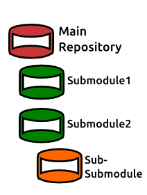
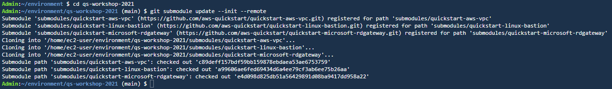
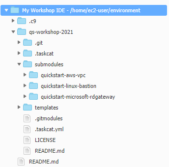

The GitHub repository that you cloned, like many Quick Start repositories, includes submodules. A submodule is another repository that is included as part of the parent repository.

[#submodules1]
.Submodule example

When you clone a repository, the contents of its submodules are not included by default, so you will need to download the submodules manually.

1. From the terminal, navigate to the cloned repository with the command *_cd qs-workshop-2021_*
2. Download the contents of the submodules with the command *_git submodule update --init --remote_*

[#submodules2]
.Submodule update

You will see that three submodules have now been downloaded: *quickstart-aws-vpc*, *quickstart-linux-bastion*, and *quickstart-microsoft-rdgateway*. These are other Quick Starts in the *aws-quickstart* organization, the contents of which have now been downloaded to your IDE. If you expand the folder view on the left-hand side you should see them.

[#submodules3]
.Expanded folder view
