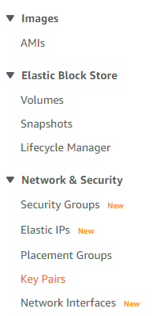

=== EC2 Key Pairs

The Quick Start that we are testing with TaskCat includes EC2 instances, which require EC2 Key Pairs to access. EC2 Key Pairs are a set of public and private key files used to securely access Linux instances, or securely reveal the Administrator passwords for Windows instances. You will need to create an EC2 Key Pair in the us-east-1 (N. Virginia) Region, and assign this key pair names to TaskCat.

1. Open the https://console.aws.amazon.com/ec2/v2/home?region=us-east-1[EC2 Management Console]
2. Select *Key Pairs* from the column on the left

[#taskcat1]
.EC2 Key Pairs

[start=3]
3. Click *Create key pair*
4. Enter a key pair name and select *pem* as the file format

[#taskcat2]
.Creating a Key Pair
image::../images/image10.png[taskcat,width=75%,height=75%]

[start=5]
5. Click *Create key pair* and save the generated .pem file somewhere on your local PC. You will need to retrieve it later to access the EC2 instances.

=== Testing CloudFormation with TaskCat

https://aws-quickstart.github.io/taskcat/[TaskCat] is a tool that tests AWS CloudFormation templates. It deploys your AWS CloudFormation template in multiple AWS Regions and generates a report with a pass/fail grade for each region. You can specify the regions and number of Availability Zones you want to include in the test, and pass in parameter values from your AWS CloudFormation template.

You can use TaskCat to validate that the forked repository's code works as expected.

1. Install TaskCat by running *_sudo pip3 install taskcat_* in the Cloud9 terminal
2. Open your global TaskCat parameter file by running *_nano ~/.taskcat.yml_*
3. Paste the following into the file. If your EC2 Key Pair name is not "workshop", replace "workshop" with whatever name you used.

----
general:
  s3_regional_buckets: true
  parameters:
    KeyPairName: workshop
----

[start=4]
4. Hold CTRL+X and then press Y and press ENTER to save the file
5. Test the forked repository's CloudFormation templates by running *_taskcat test run -l_*

[NOTE]
====
When running taskcat in Cloud9, you may encounter timeout issues. This is because the Cloud9 environment uses temporary access tokens to interact with AWS APIs. To avoid this issue, use the *aws configure* command in your Cloud9 terminal to configure an AWS Access Key ID and AWS Secret Access Key.
====

TaskCat uses the values in the *.taskcat.yml* file to determine which template(s) to launch, into which Regions to launch them, and what parameter values to use. The test should take about 20 minutes.

.TaskCat parameter file
----
project:
  name: quickstart-workshop
  owner: quickstart-eng@amazon.com
  package_lambda: false
  regions:
  - us-east-1
  - us-east-2
  - us-west-1
  - us-west-2
  s3_bucket: ''
tests:
  bastion:
    parameters:
      AvailabilityZones: $[taskcat_genaz_2]
      AdminPassword: $[taskcat_genpass_12]
      QSS3BucketName: $[taskcat_autobucket]
      QSS3BucketRegion: $[taskcat_current_region]
      EnvironmentAccessType: Bastion
      KeyPairName: $[taskcat_getkeypair]
      OperatorEmail: test@test.com
      RemoteAccessCIDR: 10.0.4.0/16
      S3BucketName: $[taskcat_random-string]
    regions:
    - us-east-1
    #- us-west-1
    s3_bucket: ''
    template: templates/workshop-main.template.yaml
----

[start=3]
3. After TaskCat finishes running, open the *taskcat_outputs/index.html* file to view the results.
